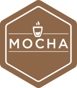
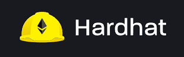

# solidity-workspace

**Workspace where we deep dive in Solidity and it's framework ecosystem and tooling**

## version covered: solidity v0.7.6

## Implemented
- ✅ Openzeppelin Ownable
- ✅ Openzeppelin AccessControl
- ✅ Openzeppelin SafeMath

<table><tr><td> </td><td display="inline">The fastest way to learn and master solidity

**This is an attempt your expedite solidity learning**
</td>
</tr>
</table>

## In addition to all other work this workspace contains SOLIDITY v0.7.6 compliant solutions to Crypto-Zombie Challenges

*disclaimer*: All logos and images owned by respective website. I don't claim any ownership over the art, logo or images used in this repo.
*some project contains solutions to challenges in https://cryptozombies.io/*
